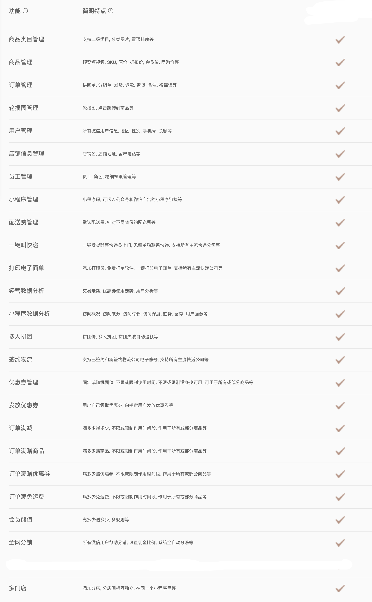

# 闪鲤私有化部署电商小程序

组成部分:

* 服务端: 提供二进制部署文件
* 管理后台端: 提供一个公共web后台及压缩后的静态文件
* 小程序端: 提供小程序源代码

## 价格

* License
    * 4999元. 买断制, 即无时间限制, 一个License和`一个域名`及`一个商城类型`绑定
* 技术咨询(可选)
    * 2000元/月

## 上线步骤

1. 购买License

    暂时请联系WX(base64): `Z3VvbXVndW9tdW5vbmc=`

2. 部署服务端

    [https://github.com/minappdev/store-server](https://github.com/minappdev/store-server)

3. 使用公共管理后台端或自己部署管理后台端

    [https://github.com/minappdev/store-admin](https://github.com/minappdev/store-admin)

4. 获得小程序代码并发布

    购买license后, 会邀请你加入小程序端代码的github私有仓库

## 七种商城类型

  
通用商城

  

